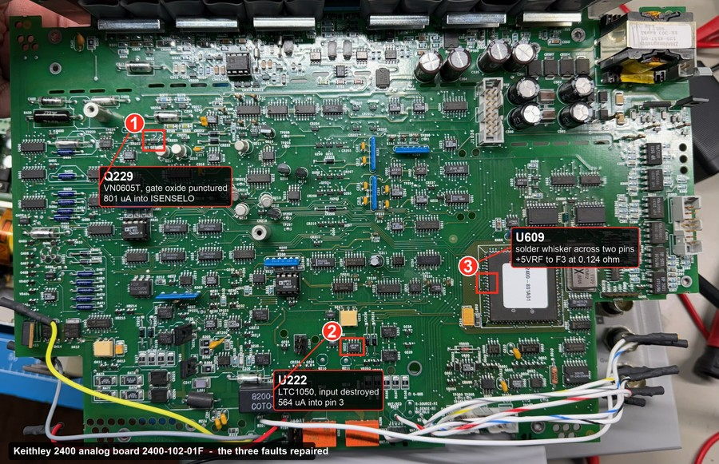
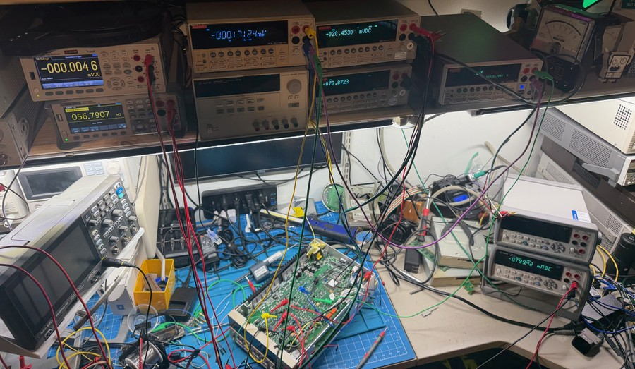
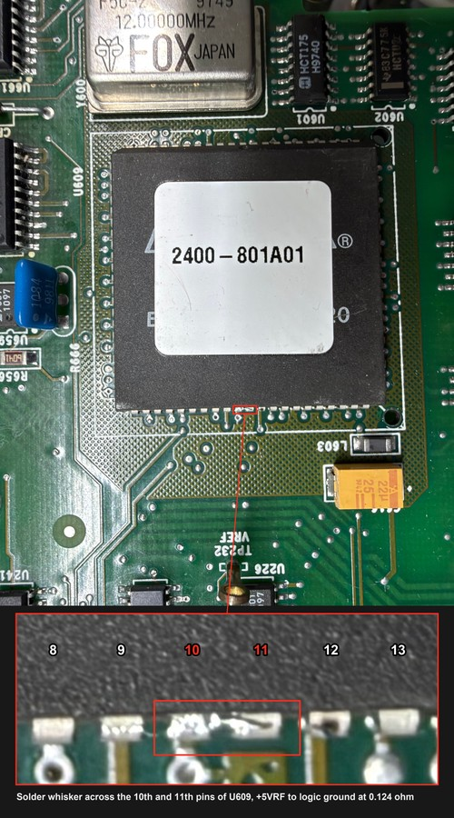
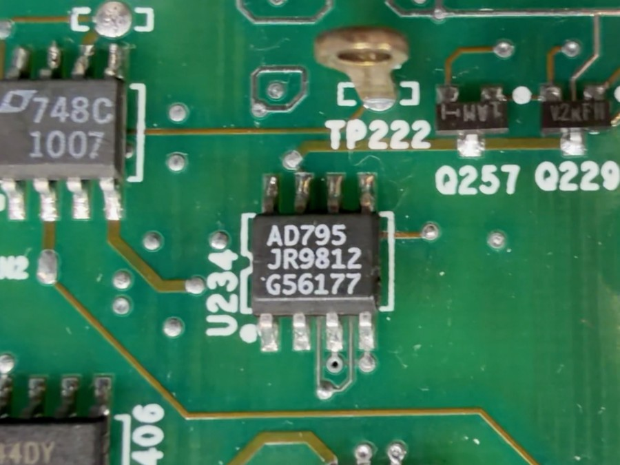

<!-- Author: Cyclotron. Unit entry for xdevs.com/fix/kei2400pp/. -->

## Diagnostics and repair for unit 8, Model 2400, S/N 0626918, Firmware C33

*Contributed by Cyclotron. Published on xDevs.com at <https://xdevs.com/fix/kei2400pp/#diagu8>.*

<p style="text-align:center;"><a href="img/board_orientation.jpg"></a></p>

This 2400 came to me in unknown condition, with analog board 2400-102-01F and cal count 9 dated 2025-12-14. With the output off the front terminals sat at -238 V, the same symptom as unit 3 above. Be careful with these. The display says OFF while the binding posts are live, and on this unit the HV filter capacitors kept the output near -234 V for minutes after power down, even with 1 MΩ across the terminals.

Date codes on the analog board run from late 1997 to early 1998. AD795 U234 is marked JR9812, 74HCT175 U601 is H9740, DG444 U406 is 9748, LT1007 U263 is 748C and the FOX 12 MHz oscillator is 9749, so the board was built in early 1998. The original LTC1050 at U222 was marked LT 808 1050, week 8 of 1998 in the same date code format as the LT1007, so it was most likely the factory part.

I first worked on this unit in November 2025. At that point I replaced parts without solid evidence for any of them, and while doing it dropped solder on the CPLD, which added a second fault on top of the first. After that I parked the unit for months. The work below was done in September 2026.

It turned out to be three faults, one of them my own, plus a full adjustment from default constants. Most of the time went into finding the faults, so that is what I have written up here.

### Output stuck at -238 V

My first suspect was the output switching and output stage, since that is where the -225 V rail is. That was wrong. The output stage and the servo were fine and the SMU was doing what it was told. About 800 µA was being injected into the low side of the current shunt network (ISENSELO). The current measurement saw that as load current, the 105 µA compliance limit tripped as soon as the output came on, and the voltage loop drove the output to the rail trying to reduce a current that was not coming from the load.

The fastest way to check this was to raise the current range above the stray current:

```
:SENS:CURR:PROT 1e-2      # set PROT first, otherwise :SENS:CURR:RANG returns error 824
:SENS:CURR:RANG 1e-2
:OUTP ON ; :READ?         # the new range only takes effect on a measurement
```

The output went from -238.5 V to following the setpoint straight away, and it repeated to within 0.4 mV on runs two days apart. It costs nothing to try on any 2400 whose output is stuck at a rail.

This was the most important result of the whole repair. The SMU could regulate voltage, so the servo, output stage, HV supplies and feedback were all working. That left two possibilities for the 800 µA. Either the current sense circuit was reporting a current that did not exist, or a real current was flowing somewhere it should not. Those lead to completely different parts of the board, so I tested it before going any further.

With the terminals open, I used the reference 2400 to push a known current into the output while this unit sourced 0 V:

| Reference 2400 injects | This unit reports | Change per step |
| --- | --- | --- |
| 0 | 777.53 µA | |
| 100 µA | 681.41 µA | -0.9612 |
| 250 µA | 537.22 µA | -0.9613 |
| 500 µA | 296.91 µA | -0.9612 |
| 1000 µA | -183.67 µA | -0.9612 |

The response to real current was a straight line with the same slope at every step, sitting on a fixed 777.5 µA offset. The 0.9612 slope is just the uncalibrated 3.9% gain error, which the adjustment later removed. The unit held 0 V (+10.8 mV) while sinking the full 1 mA, so voltage regulation worked under load too.

A current measurement that was simply broken would not track an external current this cleanly. This one measured accurately, so the 777.5 µA was most likely a real current being added inside the instrument, not something the sense circuit was making up. The Q229 section below confirms it by measuring the current directly.

### K206 does not disconnect the output

I lost a session to this one. K206, the reed relay on the HI output, does not open when the output is turned off. What happens at output off is set by `:OUTPut:SMODe`:

| Mode | What output off does |
| --- | --- |
| NORMal (default) | V-source selected and set to 0 V, compliance set to 0.5% of the present current range |
| ZERO | V-source set to 0 V, current compliance unchanged |
| GUARd | I-source selected and set to 0 A, voltage compliance set to 0.5% of the voltage range |
| HIMPedance | Output relay opens. This is the only mode that disconnects |

In the default NORMal mode, output off means the source is set to 0 V with the load still connected, and the servo keeps running. A healthy unit settles at 0 V and nothing looks wrong. This one could never reach its setpoint because of the stray current, so it sat at -239 V and K206, closed as designed, put that on the terminals.

I spent that session convinced OUTEN was stuck high, because it read +4.9224 V with the output off and +4.9273 V with it on. The measurements were right and my reading of them was wrong. OUTEN is supposed to be asserted with the output off in NORMal mode. The relay and its drive were good:

| Check | Result |
| --- | --- |
| K206 coil, cold | 294 Ω |
| Contacts open, I-V sweep to 210 V | 0.36 nA, about 600 GΩ, no knee |
| Contacts closed, -239 V on the node | -1.8 µV across the contacts |

The instrument confirmed it. `:SENS:CURR:PROT:LEV?` returned 1.05e-4 A, which is 0.5% of the 21 mA range, exactly what the manual describes for NORMal output off.

Some notes from this:

- Send `:OUTP:SMOD HIMP` before working on a unit that has voltage on the terminals it should not have. It does not survive a power cycle, so send it every session.
- HIMP is also needed to measure current with a meter in series, which comes up again in the adjustment section.
- Keithley advises against leaving HIMP selected for tests that switch the output on and off a lot, because of relay wear.
- K206 is on the HI side only. SOURCE_LO is tied to output ground, so HIMP will not remove an offset on the LO side.

### Bench setup

<p style="text-align:center;"><a href="img/bench_multimeter.jpg"></a></p>

Most of this repair was done with the analog board out of the case and eight DMMs on GPIB reading nodes on it, all read in one pass so each row of readings is from the same moment. The servo is live and hunting when the loop is broken, so readings taken a minute apart are from different operating points and do not add up. Finding where a current goes means reading every branch of a node at the same time.

Every channel was measured from one reference point and differences were worked out afterwards. Before I started doing it that way, three separate differential measurements were wrong because a low lead was not where I thought it was. On a floating analog board it is easy to put a low lead on the wrong ground.

### U609 solder whisker

<p style="text-align:center;"><a href="img/u609_whisker.jpg"></a></p>

This one was my own doing. During the November 2025 work a drop of solder left a whisker across the 10th and 11th pins of U609, the EPM7160 CPLD that carries the 2400-801A01 label. It tied the +5VRF logic supply to the logic ground at 0.124 Ω, which killed the A/D and hung the firmware. No part had failed.

The short measured 0.1235, 0.1237 and 0.1243 Ω at 0.25, 0.5 and 1.0 A. A semiconductor junction would show a knee and the resistance would fall as current went up. This was flat across a 100:1 current range, which means solder or a bridge, not silicon. I had that measurement early and should have gone looking for a bridge right then. Instead I spent time on thermal imaging, and a 0.124 Ω bridge makes almost no heat. The only part that got warm was L603, the inductor carrying the short current.

It also got past me for a whole session because the analog board has three separate floating ground nets, and TP500 (silkscreened FCOM), the obvious place to clip a meter low lead, is not the return for the logic side of the A/D section. I had every resistance measurement referenced to TP500 while the short was to the logic ground:

| What I saw | Actual cause |
| --- | --- |
| Board read 53 kΩ but pulled down a 5 V supply | I was measuring to the wrong ground. The 53 kΩ was leakage between the two ground nets |
| The chassis side also read about 53 kΩ | Same leakage path |
| The fault only showed up with both board halves connected | The ribbon cable provided the logic ground return |
| Pulling one ribbon pin cleared it and two others did nothing | That pin carries the logic ground, the other two carry the analog ground |

After the whisker came off, `:DIAG:KEIT:CNT:*?` showed all four A/D phase counters running and within 0.016% of a known good 2400.

### Q229, gate leakage on the current sense

<p style="text-align:center;"><a href="img/q229_insitu.jpg"></a></p>

The injection test showed the current measurement was working, but it did not show where the current was. To make sure it was real and not just an offset in the sense amplifier, I measured it three ways:

| Method | Reading |
| --- | --- |
| The 2400's own current measurement | 778.22 µA |
| Drop across the external shunt | 802 µA |
| Drop across R337 (4.99 kΩ) | 801.2 µA |

Two of the three do not use the 2400's measurement at all, and all three agree within 3%, so the current was real. After that I followed the current through each branch leaving ISENSELO until the numbers balanced:

```
  OUTSTAGE        -0.000100 V   --DG444, 13.5 ohm--
  ISENSEHI        -0.010876 V   --R455, 100 ohm--       80.16 mV   802 uA
  midpoint        -0.091033 V   --R454, 100 ohm--       80.16 mV   802 uA
  ISENSELO        -0.171190 V   --R337, 4.99 kohm--   3998.18 mV   801.2 uA
  Q229 gate       -4.169368 V
```

Every other branch off ISENSELO measured under 50 nA. Nearly all of the current went through R337 into the gate of Q229, a VN0605T. R337 is a gate resistor and should carry no current, and the VN0605T gate leakage limit is 100 nA. It was passing 801 µA.

Before probing the gate I worked out that it had to be at about -4.16 V for that current to flow. It measured -4.169368 V. I made a habit of writing the expected reading down before each measurement. When a reading does not match, the problem is usually the setup or my understanding of the circuit, and it is better to find that out before ordering parts.

Removing Q229 took the offset from 778 µA to -0.01 µA on the 105 µA range. CR400 and CR401, which I had pulled as suspects, went back in with no change. The VN0605T is obsolete. I used a 2N7002E, and since 23 positions on this board use the VN0605T it is worth keeping a few spares.

### U222, damaged input on the LO buffer

With Q229 replaced the 2400 regulated, but the output was 5.7 V off zero at a setpoint of 0 and the adjustment procedure rejected every value I sent it.

The same method found it. About 570 µA was flowing from SOURCE_LO through R149 (10 kΩ) into the input of the LO sense buffer, pulling that net 5.708 V below ground. Accounting for the branches put nearly all of it into pin 3 of U222, an LTC1050 chopper op-amp with input bias current of 10 pA typical and 75 pA maximum.

That left two possibilities. The current could be going into the IC, or across the board from pad 3 to pad 4, since those pins are next to each other on the SO-8 and pin 4 is V-. Flux residue or a whisker of around 11 kΩ there would look exactly the same. I wanted to know which before replacing anything, because the second is fixed with a cleaning.

Lifting pin 3 did not answer it. With the pin lifted the output read -0.0018 V at every setpoint, because the feedback path was open, and that looks the same as a repaired buffer.

What worked was to reconnect the lifted pin through a resistor and measure the current in the lead:

```
  pad 3  ---[ 100 ohm, measured 100.2247 ]---  U222 pin 3
```

The resistor also reconnects the input, so it is never floating with power on. If around 57 mV shows across it, the current is going into the IC. If the drop is small while R149 still carries 570 µA, the current is leaving on the board side.

It measured +56.45 to +56.59 mV in every output state, 563 to 565 µA into the pin. I expected adding 100 Ω in series with R149 to drop 570.8 µA to 565.1 µA, and it did. The current was going into U222.

A few notes if you try this:

- Measure the resistor before fitting it and probe across the resistor body, not from pad to pin. The pigtails and solder joints then stay out of the measurement, and the current is the same everywhere in the chain.
- Use the measured value. 100.2247 Ω instead of 100 Ω changes the result by 0.24%.
- Check the meter and leads first with the resistor on the bench. I sourced 570 µA through it from the reference 2400 and read the drop with the same meter and channel I used on the board. It read within 73 nA.

The clamp network on the same net read about 18 mV above the buffer input in every state, so the clamp diodes were not conducting.

I think the Q229 fault caused this. With the output driven to -239 V, the floating analog section was pushed hard against output ground, and the LTC1050 input is only rated to 0.3 V beyond its supply rails. R149 is the only thing limiting the LO input current. I could not confirm this, and there is still the question of what drove the output there in the first place. If it was something other than Q229, the new part will fail the same way.

The supply rails for U222 measured ±7.5 V, 15 V total, which is inside the LTC1050's 18 V rating. Keithley may have changed this position to the LTC1150CS8 on later boards, but what I have is inconclusive. The LTC1150 has the same pinout, is rated for 32 V supply, and pins 1, 5 and 8 are unconnected on this board, so it drops straight in. Its input limit relative to the rails is the same as the LTC1050. On the HI side the matching buffer, U219, has 1 kΩ of series resistance on its input compared to 10 kΩ on the LO side.

### Verification and adjustment

In November 2025, before I had studied the circuits and nets much, I replaced both AD7849 DACs (U660 and U661) and three amplifiers: the two AMP03 difference amplifiers U221 and U227 that feed back output voltage and current, and U500, the AD847 driving the output stage. Some of that came from data I misread and some from suggestions about the root cause. U221 in particular gets suspected because it was the fault on the 2425, S/N 816992, above. None of these were the problem, and swapping them did not change the fault. The three amplifiers are now in sockets, which makes them easy to swap back if needed.

With that many parts changed, the stored adjustment constants no longer matched the board.

The 20 V source range was producing 13.38 V for a 20 V setting, a ratio of 0.67. The stored constants for that range were lopsided, 1519.150 positive gain against 1995.850 negative, where the other ranges were symmetric at ±2978.864. Those constants predicted the measured output to within 21 ppm, so the problem was in the stored data and not the hardware.

It still could not be adjusted. For each `:CAL:PROT:SOUR` value the 2400 checks that the value falls in the window for that range, and also that the source is programmed to a value in the same window. At a 0.67 ratio no setting passes both checks, since reaching -18 V at the terminals would need a -26.9 V setting, past the end of the range.

`:DIAG:KEIT:INITCAL` got around it. It resets all adjustment constants to defaults, every range at once, so dump everything with `:CAL:PROT:SOUR:DATA?` and `:CAL:PROT:SENS:DATA?` first. After the reset the 20 V range gave -19.92 V for a -20 V setting and adjusted normally.

I used a Keithley 2002 as the reference DMM and followed the service manual procedure. The results against the one year SPEC-2400 Rev. L limits:

| Function | Ranges | Source | Measure |
| --- | --- | --- | --- |
| Voltage | 0.2, 2, 20, 200 V | 16 of 16 in spec | 16 of 16 in spec |
| Current | 1 µA to 1 A | 28 of 28 in spec | 28 of 28 in spec |

The worst point used 11% of its limit. After an overnight soak with the covers on, the median change was 5.3 ppm. Only the 1 µA range moved noticeably, about 130 ppm, around 150 pA.

These are the things that cost me adjustment runs. Each was my setup, not the instrument:

- In the default NORMal output-off mode the output relay stays closed and the output holds 0 V. With the DMM in series for current adjustment, the 2400 drove current through it with the output off, from -25 µA to -410 µA depending on range. With `:OUTP:SMOD HIMP` the same loop read +1.3 nA. I had been using output off to zero the reference meter, which subtracted that current from every reading. Three saved adjustments were wrong because of it, and I briefly chased a ±1 µA hysteresis near zero that went away once the relay was really open.
- The first reading after a function or range change is not reliable. The 2002 returned 9.9E37 and a Siglent returned -18 V drifting toward its real -6.94 V, both right after a range or function change. Take one reading and throw it away.
- Take several readings at each point. One reading will not show that it was unsettled, that a probe moved, or that a connection is intermittent. If several readings are exactly identical, the interface is probably returning a stale value.
- Wait for each adjustment step to complete with `*OPC?` or `*OPC` before sending the next command. The service manual says so, and my script did not do it at first.
- I set the 2002 to NPLC 50 and broke communication through the GPIB gateway. At NPLC 20 and above, replies came back one query behind, and at NPLC 40 they stopped. NPLC 10 was the highest that worked reliably.

### Hidden :DIAG:KEITHley commands

The C34 firmware has 549 SCPI commands. 63 of them are not in any Keithley manual or datasheet, and all 63 are in the `:DIAGnostic:KEITHley` subsystem. Anyone with a firmware image can pull these out, so here is the full list to save the next person the work. The names, argument types and whether a query form exists come directly from the ROM.

The secret menu on this site's [Keithley secret menu guide](https://xdevs.com/guide/keithley_secret/) is not needed for these. SECRET only adds items to two front-panel menus. `:DIAG:KEIT` commands are accepted normally, so a `-113 Undefined header` means older firmware or a typo.

19 of the 63 have no query form. That includes ISN, IBBR, BOOT and CCR, which some repair notes suggest as first queries to send. Sent with `?` they return `-113`, and sent without it they write. IBBR cannot tell you the model because its write form is what sets the `*IDN?` string. Use `*IDN?`. As the secret menu table earlier on this page warns, changing the model loses calibration. There is also no general memory read or write command. Each command writes one fixed location.

I have only added notes for commands I sent during this repair. A blank note means I did not use it.

| Command | Query form | Argument | Notes from this repair |
| --- | --- | --- | --- |
| `:DIAG:KEIT:AHWREV` | yes | string | Returned `?` on this unit. |
| `:DIAG:KEIT:BITS:AFB` | yes | integer (register) |  |
| `:DIAG:KEIT:BITS:DATA` | yes | number/boolean | Sent to the reference 2400, not this unit. The query hung the GPIB parser and the next command failed with `-420`. |
| `:DIAG:KEIT:BITS:IDAC` | yes | integer (register) |  |
| `:DIAG:KEIT:BITS:INT` | yes | integer (register) |  |
| `:DIAG:KEIT:BITS:MUX` | yes | integer (register) |  |
| `:DIAG:KEIT:BITS:REF` | yes | integer (register) |  |
| `:DIAG:KEIT:BITS:RNG` | yes | integer (register) |  |
| `:DIAG:KEIT:BITS:SIG1` | yes | integer (register) |  |
| `:DIAG:KEIT:BITS:SIG2` | yes | integer (register) |  |
| `:DIAG:KEIT:BITS:SYS` | yes | integer (register) |  |
| `:DIAG:KEIT:BITS:VDAC` | yes | integer (register) |  |
| `:DIAG:KEIT:BITS:ZERO` | yes | integer (register) |  |
| `:DIAG:KEIT:BOOT` | no | none | Sent as a query only, returned `-113`. |
| `:DIAG:KEIT:CCHK` | yes | number/boolean |  |
| `:DIAG:KEIT:CCR` | no | none | Sent as a query only, returned `-113`. |
| `:DIAG:KEIT:CCREV` | yes | string |  |
| `:DIAG:KEIT:CNT:REF` | yes | none | See CNT:SIG1. |
| `:DIAG:KEIT:CNT:SIG1` | yes | none | All four counters read 0 while the A/D was dead. After the U609 whisker was removed they read within 0.016% of a known good 2400. |
| `:DIAG:KEIT:CNT:SIG2` | yes | none | See CNT:SIG1. |
| `:DIAG:KEIT:CNT:ZERO` | yes | none | See CNT:SIG1. |
| `:DIAG:KEIT:DBUR` | no | number/boolean |  |
| `:DIAG:KEIT:DCMD` | no | integer (register) |  |
| `:DIAG:KEIT:DHWREV` | yes | string | Returned `?` on this unit. |
| `:DIAG:KEIT:DISP` | no | string |  |
| `:DIAG:KEIT:EES` | yes | none |  |
| `:DIAG:KEIT:ENAB` | yes | number/boolean |  |
| `:DIAG:KEIT:FAN` | no | integer |  |
| `:DIAG:KEIT:FTYP` | yes | none |  |
| `:DIAG:KEIT:GPIB` | no | number/boolean |  |
| `:DIAG:KEIT:IBBR` | no | enum | Sent as a query only, returned `-113`. It has no query form and cannot report the model. Use `*IDN?`. |
| `:DIAG:KEIT:ILIN1` | yes | none |  |
| `:DIAG:KEIT:ILIN2` | yes | none |  |
| `:DIAG:KEIT:ILIN3` | yes | none |  |
| `:DIAG:KEIT:ILIN4` | yes | none |  |
| `:DIAG:KEIT:INITCAL` | no | none | Sent once. Resets all adjustment constants to defaults. This is how the 20 V range was recovered. No query form and no undo. |
| `:DIAG:KEIT:INT` | yes | none |  |
| `:DIAG:KEIT:ISN` | no | string |  |
| `:DIAG:KEIT:KEY` | yes | none | Returned 82 on one boot, a latched key code. |
| `:DIAG:KEIT:KEYLOCK` | yes | enum |  |
| `:DIAG:KEIT:LVOL` | yes | number/boolean |  |
| `:DIAG:KEIT:MELTDOWN` | no | none |  |
| `:DIAG:KEIT:NOPULSE` | yes | number/boolean |  |
| `:DIAG:KEIT:OLIN1` | no | number/boolean |  |
| `:DIAG:KEIT:OLIN2` | no | number/boolean |  |
| `:DIAG:KEIT:OLIN3` | no | number/boolean |  |
| `:DIAG:KEIT:OLIN4` | no | number/boolean |  |
| `:DIAG:KEIT:OTDIS` | no | none |  |
| `:DIAG:KEIT:PROG` | no | none |  |
| `:DIAG:KEIT:SECRET` | yes | number/boolean |  |
| `:DIAG:KEIT:SET:REF` | yes | integer (register) |  |
| `:DIAG:KEIT:SET:SIG1` | yes | integer (register) |  |
| `:DIAG:KEIT:SET:SIG2` | yes | integer (register) |  |
| `:DIAG:KEIT:SET:ZERO` | yes | integer (register) |  |
| `:DIAG:KEIT:SETUP1` | yes | string |  |
| `:DIAG:KEIT:SETUP2` | yes | string |  |
| `:DIAG:KEIT:SETUP3` | yes | string |  |
| `:DIAG:KEIT:SETUP4` | yes | string |  |
| `:DIAG:KEIT:SETUP5` | yes | string |  |
| `:DIAG:KEIT:SPHAS` | yes | integer |  |
| `:DIAG:KEIT:STES` | yes | none | Returned `0`. |
| `:DIAG:KEIT:UNLOCK` | no | none |  |
| `:DIAG:KEIT:VREF` | no | number/boolean | Query returned `6.20`. I only used the query. The write form changes a calibration value. |

INITCAL was the only command I used to write anything. Everything else was read only.

### Summary for this unit

| Fault | Cause | Fix |
| --- | --- | --- |
| A/D dead, firmware hanging | Solder whisker across the 10th and 11th U609 pins, +5VRF to logic ground at 0.124 Ω, from my own work in November 2025 | Whisker removed, no parts replaced |
| -238 V on the terminals with output off | Q229 (VN0605T) gate leaking 801 µA into ISENSELO, tripping compliance and driving the output to the rail | Q229 replaced with 2N7002E |
| 5.7 V output offset, adjustment rejected | U222 input damaged, 564 µA into pin 3 | U222 replaced |
| 20 V range at a 0.67 ratio | Bad stored adjustment constants | `:DIAG:KEIT:INITCAL`, then full adjustment |
| None | U660, U661 (AD7849), U221, U227 (AMP03) and U500 (AD847) replaced in November 2025 on suspicion | Not faulty. Amplifiers left in sockets |

The 2400 now sources and measures within specification on every range, and passed the overnight soak.

### Thanks to xDevs.com

Most of what let me repair this unit came from pages the xDevs.com team wrote and kept online: the repair and calibration notes on the Keithley SourceMeters, the photos and measurements from earlier units, and the diagnostic procedures written up in enough detail to repeat. Ilya and the team have spent years documenting, restoring and repairing test equipment and publishing the results for anyone to use, and that record is a large part of why these instruments are still repairable. Thank you.
