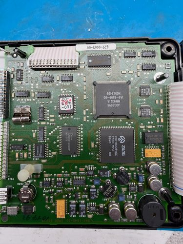
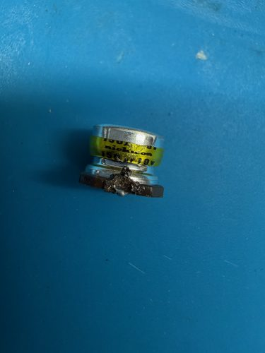

<!-- Draft skeleton: photos, BOM and equipment are in place; the fault-finding
narrative below is a placeholder for the operator's own account and should
not be treated as a finished write-up until that section is replaced. -->

## Tektronix THM565 "TekMeter", S/N B090062

*To be contributed by Cyclotron.*

### What this covers

Two related pieces of work on the same instrument: a capacitor
replacement on the main board, and a firmware-update tool built for the
THM5xx family and validated against this unit (see
[THM565-Flash](https://github.com/Cyclotronic/THM565-Flash), a separate
repository - the reverse-engineering and emulator work behind it is
summarized there, not repeated here).

### The instrument

Tektronix THM565, serial B090062. Main board part number 679-0065-00.
Photos below identify a Zilog Z8018008VSC (Z180 MPU), an Analog Devices
ADG309B, and the 156-6599-00 ASIC (MM9371A) on the main board.

### Fault and repair

*(Placeholder - needs the operator's own account: what the symptom was,
how it was traced to these capacitors, and anything that went wrong along
the way. The photos and BOM below are in place to support that write-up.)*

Capacitors ordered for the repair, pulled from the supplier packing list
(not published - see [bom/capacitors.md](bom/capacitors.md) for why and
for the full table):

| Manufacturer P/N | Description | Qty |
| --- | --- | --- |
| EEE-FK1C220R | CAP ALUM 22uF 20% 16V SMD | 10 |
| EEE-FK1V100R | CAP ALUM 10uF 20% 35V SMD | 10 |
| EEE-FC1A151P | CAP ALUM 150uF 20% 10V SMD | 10 |
| SR205E474MARTR2 | CAP CER RADIAL 0.47uF 20% | 20 |
| EEU-FR1H100B | CAP ALUM 10uF 20% 50V RADIAL TH | 20 |
| ECA-1JM100 | CAP ALUM 10uF 20% 63V RADIAL TH | 20 |
| ECA-1JM102 | CAP ALUM 1000uF 20% 63V RADIAL TH | 10 |
| ECE-A1HKS100B | CAP ALUM 10uF 20% 50V RADIAL TH | 20 |

Full detail, including DigiKey part numbers, is in
[bom/capacitors.md](bom/capacitors.md).

### The 067-1446-99 firmware/programming fixture

The THM5xx firmware-reload, config-burn and cal-burn commands (see
[THM565-Flash](https://github.com/Cyclotronic/THM565-Flash)) go through
Tektronix's 067-1446-99 test fixture, not a plain serial cable - it also
switches the flash chip's 12V programming voltage. Plans and a bill of
materials for this fixture, and for the THM565 itself, were shared on
EEVblog by user TERRA Operative:
<https://www.eevblog.com/forum/testgear/tektronix-thm56x-portable-scope-hackteardowndiscussion/msg6265840/#msg6265840>

None of the flash reload/config/cal testing behind THM565-Flash would have
been possible without that fixture. Thanks to TERRA Operative for posting
it.

### Photos

`img/` has the full set this draft draws from, each as a full-resolution
photo with a linked thumbnail. Board photos, capacitor removal/measurement
photos, and the fixture build are all in there; only a representative
subset is embedded above. `img/scope_demo_clip.mov` is a short clip of the
bench TekMeter reading a waveform during testing.
